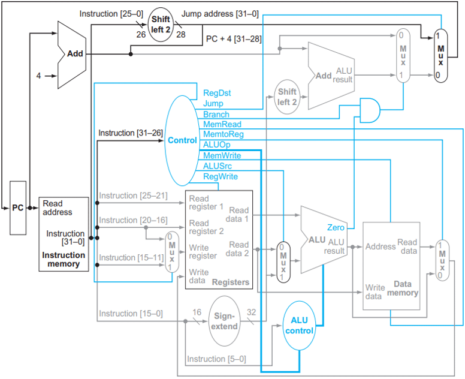
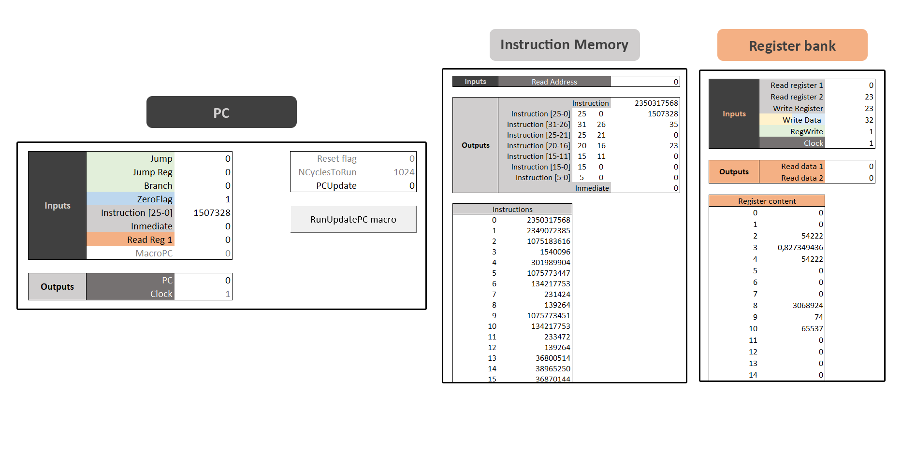
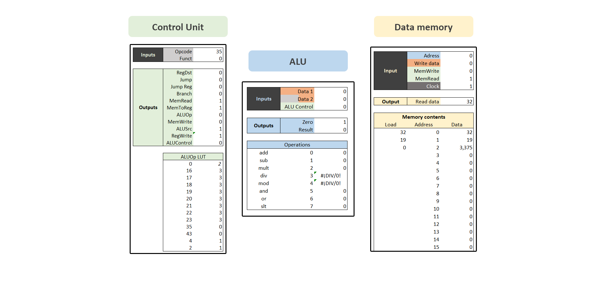

# MIPS excel simulator
This is a simulator of a MIPS microprocesor built using plain excel formulas. This design is ment for educational purposes only. The implemented MIPS version is the following non-pipelined version


## Table of contents
- [**Modules**](#modules)
- [**Instruction set**](#instruction-set)
    * **R-Type**
    * **I-Type**
    * **IO**
    * **Branch**
    * **Jump**
- [**Use of compiler**](#use-of-compiler)
- [**Example program**](#example-program)

## Modules
The microprocesor is divided in the following modules:
- PC (Program Counter)
- Instruction Memory
- Register Bank
- ALU (Arithmetic Logic Unit)
- Control Unit
- Data Memory

Each module of the microprocesor is implemented on a different excel page, organized as follows:


A VB macro which updates the clock every second can be triggered by hitting the button on the PC page.

## Instruction set
<table>
  <tr>
    <td>Type</td>
    <td>Name</td>
    <td>Arguments</td>
    <td>Notes</td>
  </tr>
  <tr>
    <td rowspan="9"><b>R-Type</b></td>
    <td>add</td>
    <td>rs, rt, rd</td>
    <td></td>
  </tr>
  <tr>
    <td>sub</td>
    <td>rs, rt, rd</td>
    <td></td>
  </tr>
  <tr>
    <td>mult</td>
    <td>rs, rt, rd</td>
    <td></td>
  </tr>
  <tr>
    <td>div</td>
    <td>rs, rt, rd</td>
    <td></td>
  </tr>
  <tr>
    <td>mod</td>
    <td>rs, rt, rd</td>
    <td></td>
  </tr>
  <tr>
    <td>and</td>
    <td>rs, rt, rd</td>
    <td></td>
  </tr>
  <tr>
    <td>or</td>
    <td>rs, rt, rd</td>
    <td></td>
  </tr>
  <tr>
    <td>slt</td>
    <td>rs, rt, rd</td>
    <td></td>
  </tr>
  <tr>
    <td>move</td>
    <td>rt, rd</td>
    <td>Pseudo-instruction (provided by compiler)</td>
  </tr>
  <tr>
    <td rowspan="10"><b>I-Type</b></td>
    <td>addi</td>
    <td>rs, rt, inmediate</td>
    <td></td>
  </tr>
  <tr>
    <td>subi</td>
    <td>rs, rt, inmediate</td>
    <td></td>
  </tr>
  <tr>
    <td>multi</td>
    <td>rs, rt, inmediate</td>
    <td></td>
  </tr>
  <tr>
    <td>divi</td>
    <td>rs, rt, inmediate</td>
    <td></td>
  </tr>
  <tr>
    <td>modi</td>
    <td>rs, rt, inmediate</td>
    <td></td>
  </tr>
  <tr>
    <td>andi</td>
    <td>rs, rt, inmediate</td>
    <td></td>
  </tr>
  <tr>
    <td>ori</td>
    <td>rs, rt, inmediate</td>
    <td></td>
  </tr>
  <tr>
    <td>slti</td>
    <td>rs, rt, inmediate</td>
    <td></td>
  </tr>
  <tr>
    <td>inc</td>
    <td>rs</td>
    <td>Pseudo-instruction (provided by compiler)</td>
  </tr>
  <tr>
    <td>dec</td>
    <td>rs</td>
    <td>Pseudo-instruction (provided by compiler)</td>
  </tr>
  <tr>
    <td rowspan="2"><b>IO</b></td>
    <td>lw</td>
    <td>rs, rt, offset</td>
    <td></td>
  </tr>
  <tr>
    <td>sw</td>
    <td>rs, rt, offset</td>
    <td></td>
  </tr>
  <tr>
    <td><b>Branch</b></td>
    <td>beq</td>
    <td>rs, rt, address offset</td>
    <td></td>
  </tr>
  <tr>
    <td rowspan="3"><b>Jump</b></td>
    <td>j</td>
    <td>address</td>
    <td></td>
  </tr>
  <tr>
    <td>jr</td>
    <td>rs</td>
    <td></td>
  </tr>
  <tr>
    <td>jal</td>
    <td>address</td>
    <td>Pseudo-instruction (provided by compiler)</td>
  </tr>
</table>

## Use of compiler
The python script `compiler.py` compiles all assembly files in the `./src/` folder and stores a compiled binary version at `./bin/` as well as a binary version at `./dec/`. You can copy this last binary version and paste it at the instrucion memory.

The compiler can be invoked just by using `python compiler.py`. No external libraries are required.

## Example program

Example of an assembly program to compute $e^x$ using taylor series.

```nasm 
; Compute e^x where x is the first number in memory, using Taylor series
; The second number in memory is used as the number of iterations to perform

; Load data
LW $0 $s0 0   ; x
LW $0 $s1 1   ; n
MOVE $0 $s2   ; result
MOVE $0 $s3   ; i

INC $s1
@LoopBegin
BEQ $s3 $s1 @LoopEnd

; Call power
MOVE $s0 $a0
MOVE $s3 $a1
JAL @power
MOVE $v0 $s4

; Call factorial
MOVE $s3 $a0
JAL @factorial
MOVE $v0 $s5

; Update value
DIV $s4 $s5 $s6
ADD $s2 $s6 $s2

INC $s3

J @LoopBegin
@LoopEnd

; Store result
SW $0 $s2 2

J @End


; Power function
@power
    LOADI $v0 1

    @LoopBegin1
    BEQ $a1 $0 @LoopEnd1

    MULT $a0 $v0 $v0
    DEC $a1

    J @LoopBegin1
    @LoopEnd1

    JR $ra


; Factorial function
@factorial
    LOADI $v0 1
    
    @LoopBegin2
    BEQ $a0 $0 @LoopEnd2

    MULT $a0 $v0 $v0
    DEC $a0

    J @LoopBegin2
    @LoopEnd2

    JR $ra


@End
```
